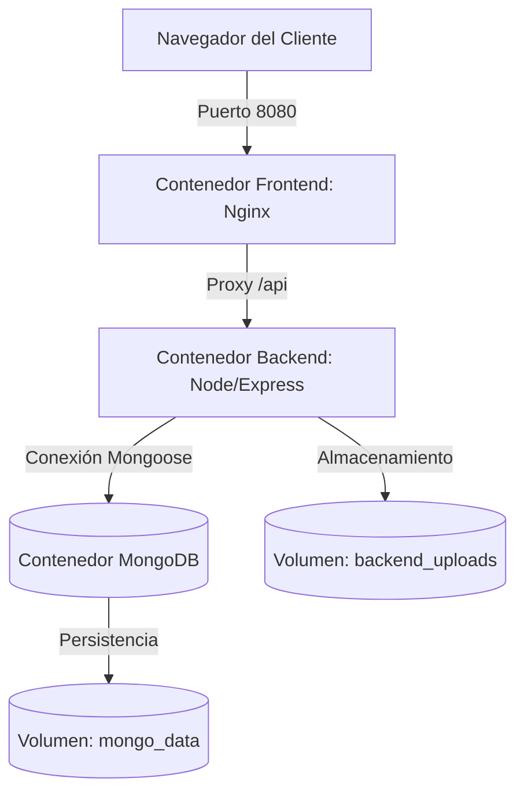

# Manual de Despliegue en Producción – CertVault

Este documento describe la arquitectura de despliegue, la configuración de contenedores y los pasos necesarios para desplegar y mantener **CertVault** en entornos de producción utilizando **Docker**, **Docker Compose** y **Portainer**.

---

## 1. Arquitectura de Contenedores

CertVault está diseñado bajo una arquitectura de microservicios contenerizada con tres componentes principales definidos en el archivo `docker-compose.yml`:



* **Frontend (Nginx + Angular):** Escucha en el puerto configurado (por defecto `8080`) y actúa como servidor web estático y reverse proxy para redireccionar las llamadas `/api` hacia el contenedor del backend.
* **Backend (Node.js/TypeScript):** Servicio REST API que ejecuta la lógica de negocios y las tareas en segundo plano (servicio cron de expiración de contraseñas).
* **MongoDB:** Base de datos NoSQL persistente utilizada para almacenar los esquemas de usuarios, certificaciones, auditorías y configuraciones.

---

## 2. Configuración de Variables de Entorno (.env)

Antes de iniciar el despliegue, se debe crear un archivo `.env` en la raíz del repositorio basándose en `.env.example`. Las siguientes variables son críticas para producción:

| Variable | Descripción | Valor de Ejemplo / Recomendado |
| :--- | :--- | :--- |
| `NODE_ENV` | Modo de ejecución del backend. | `production` |
| `APP_HOST` | Host o dirección IP pública del servidor. | `172.20.15.16` o `certvault.empresa.corp` |
| `FRONTEND_PORT` | Puerto de exposición web externo. | `80` o `8080` |
| `JWT_SECRET` | Llave secreta para firmar tokens de sesión. | *Generar una cadena aleatoria y compleja* |
| `SMTP_HOST` | Servidor SMTP para alertas de expiración y respaldos. | `smtp.office365.com` o `smtp.gmail.com` |
| `SMTP_PORT` | Puerto del servidor de correos. | `587` |
| `SMTP_ENCRYPTION_KEY` | Llave utilizada para encriptar contraseñas de SMTP en BD. | *Generar una llave aleatoria de 32 bytes en hex* |
| `SEED_DATABASE` | Evita sembrar datos de ejemplo en producción. | `false` |

---

## 3. Despliegue con Docker Compose (Línea de Comandos)

Si tienes acceso ssh al servidor de producción, ejecuta el siguiente flujo para desplegar desde cero o aplicar actualizaciones:

### Paso 1: Descargar cambios y preparar el entorno
```bash
# Descargar la última versión estable del repositorio
git pull origin main

# Validar que el archivo .env tenga las configuraciones correctas
cat .env
```

### Paso 2: Construir e iniciar contenedores
La reconstrucción sin caché asegura que Docker compile nuevamente las imágenes con el código TypeScript actualizado de Angular y Node.js de forma limpia:
```bash
docker compose build --no-cache && docker compose up -d
```

### Paso 3: Verificar estado de salud de los servicios
```bash
docker compose ps
```
El contenedor `certvault-mongo` debe reportar estado `healthy` gracias al healthcheck incorporado.

---

## 4. Gestión de Volúmenes y Persistencia de Datos

Para evitar la pérdida de información curricular y certificados cuando los contenedores se detienen, destruyen o actualizan, se definieron dos volúmenes persistentes gestionados por Docker:

* `mongo_data` (Mapeado a `/data/db` en el contenedor `mongo`): Almacena las colecciones de base de datos.
* `backend_uploads` (Mapeado a `/app/uploads` en el contenedor `backend`): Almacena los archivos físicos de certificados subidos por los técnicos y los avatares de perfil.

### Copias de seguridad externas (Backups a nivel OS)
Se recomienda automatizar tareas cron en el servidor anfitrión para respaldar estos directorios:
* Directorio de base de datos: Ejecutar `docker exec -t certvault-mongo mongodump --archive=/data/db/backup.archive` periódicamente.
* Directorio de archivos: Respaldar la carpeta de volúmenes de docker, usualmente ubicada en `/var/lib/docker/volumes/certvault_backend_uploads/_data`.

---

## 5. Diagnóstico de Fallas (Troubleshooting)

Si el entorno no levanta correctamente o experimentas problemas de comunicación, realiza los siguientes pasos de diagnóstico:

### Problema 1: El despliegue falla por conflictos de puertos
* **Síntoma:** Error `Bind for 0.0.0.0:XXXX failed: port is already allocated` o `address already in use` durante el comando de subida.
* **Causa:** Otro servicio (un Nginx local, Apache o MongoDB nativo) ya está utilizando los puertos de exposición (`8080`, `3000` o `27018`).
* **Solución:** Modifica los valores de `FRONTEND_PORT` o `MONGO_PORT` en el archivo `.env` por puertos libres en el host. Luego vuelve a reconstruir:
  ```bash
  docker compose build --no-cache && docker compose up -d
  ```

### Problema 2: Error "502 Bad Gateway" en el navegador
* **Síntoma:** Nginx responde con error 502 al intentar cargar la aplicación web o al procesar llamadas a la API `/api`.
* **Causa 1:** El contenedor `certvault-backend` se detuvo tras iniciarse. Ejecuta `docker compose ps` para verificar su estado. Si reporta fallos, revisa la causa con:
  ```bash
  docker logs certvault-backend
  ```
* **Causa 2:** Configuración incorrecta en el archivo `.env`. Asegúrate de que `BACKEND_UPSTREAM_HOST` esté seteado exactamente como `backend` (el nombre del servicio interno en la red de Docker) y que `MONGODB_URI` use el host de base de datos `mongo` (ej: `mongodb://mongo:27017/certif-app`). Usar `localhost` o `127.0.0.1` en `MONGODB_URI` causará que el backend no pueda comunicarse con la base de datos al estar aislado dentro de su contenedor.

### Problema 3: El backend está atascado en estado "restarting" o "unhealthy"
* **Síntoma:** El contenedor de backend no arranca y el estado general muestra reinicios constantes.
* **Causa:** El backend depende de que el contenedor de MongoDB pase el healthcheck (`service_healthy`). Si MongoDB no inicia correctamente, el backend nunca arrancará.
* **Solución:** Revisa la inicialización de la base de datos:
  ```bash
  docker logs certvault-mongo
  ```
  Verifica que el almacenamiento del host no esté lleno y que el volumen `mongo_data` no tenga archivos corruptos por apagados forzados.

### Problema 4: Error al subir archivos o certificados en la aplicación
* **Síntoma:** Al adjuntar certificados o actualizar avatares, la consola o la API retornan errores de escritura.
* **Causa:** Problemas de permisos en el sistema de archivos del anfitrión respecto al volumen mapeado `/app/uploads` (`backend_uploads`).
* **Solución:** Verifica que el daemon de Docker tenga permisos de escritura en la ruta de volúmenes de Docker (usualmente bajo `/var/lib/docker/volumes/`). Si es necesario, fuerza el recreado del volumen deteniendo el stack y levantándolo nuevamente.

### Comandos de diagnóstico rápido
* **Revisar estado de todos los servicios:** `docker compose ps`
* **Inspeccionar logs unificados (tiempo real):** `docker compose logs -f`
* **Revisar logs de un contenedor específico:** `docker logs -f certvault-backend`
* **Reiniciar un contenedor específico:** `docker compose restart backend`
