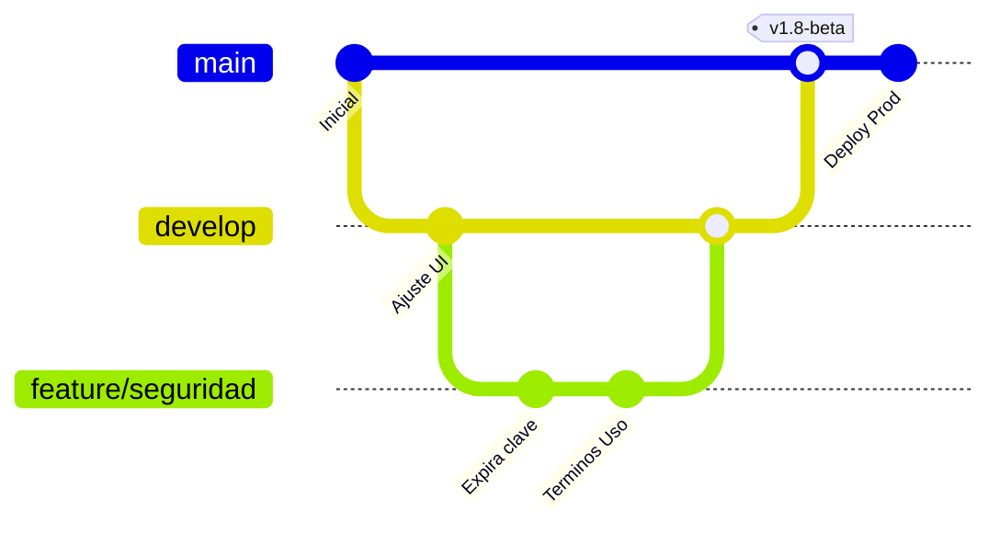

# Flujo de Trabajo con Git y Ciclo de Actualizaciones – CertVault

Este manual establece las buenas prácticas para la gestión del repositorio Git en **CertVault** y define el ciclo de actualización de código y despliegue continuo en el servidor de producción.

---

## 1. Estructura de Ramas (Git Flow Simplificado)

El repositorio de CertVault utiliza un modelo de ramas ordenado para garantizar que el código en producción permanezca estable mientras se desarrollan nuevas funcionalidades de auditoría y seguridad:



* **`main` (Producción):** Contiene código altamente estable listo para producción. Cada cambio en esta rama debe asociarse a una versión mediante tags (`v1.8-beta`).
* **`develop` (Integración):** Rama principal de desarrollo donde se consolidan todas las nuevas características antes de pasar a producción.
* **`feature/*` (Características):** Ramas temporales creadas a partir de `develop` para programar una tarea específica (ej: `feature/terminos-y-condiciones`). Se fusionan de vuelta a `develop` mediante Pull Requests.
* **`bugfix/*` / `hotfix/*` (Correcciones):** Ramas destinadas a corregir problemas urgentes detectados directamente en producción (`main`) o pruebas (`develop`).

---

## 2. Ciclo de Despliegue en Producción tras un `git pull`

Cuando realizas cambios en el código (ya sea en el backend de Node o el frontend de Angular) y los subes al repositorio principal, debes aplicar los cambios en el servidor de producción.

Dado que la aplicación se ejecuta dentro de contenedores de Docker, **hacer `git pull` en la carpeta del servidor no es suficiente**. Es indispensable compilar el nuevo código TypeScript e inyectarlo en las imágenes activas de Docker.

Sigue este procedimiento en el servidor de producción paso a paso:

```bash
# 1. Accede a la carpeta raíz del proyecto en el servidor
cd /home/despinoza/certvault

# 2. Descarga los últimos cambios de la rama principal
git pull origin main

# 3. Reconstruye las imágenes sin usar caché y levanta los contenedores
docker compose build --no-cache && docker compose up -d
```

### Reconstrucciones selectivas (Optimización de tiempo)
Si sabes con exactitud qué componente modificaste, puedes reconstruir únicamente ese servicio de manera limpia para optimizar tiempos:

* **Si solo editaste el Backend:**
  ```bash
  docker compose build --no-cache backend && docker compose up -d backend
  ```
* **Si solo editaste el Frontend (Angular):**
  ```bash
  docker compose build --no-cache frontend && docker compose up -d frontend
  ```

---

## 3. Convenio de Mensajes de Commit

Para mantener el historial Git y el [CHANGELOG.md](../CHANGELOG.md) legibles y estructurados, se recomienda utilizar el estándar de commits semánticos:

* **`feat:`** Una nueva característica (ej: `feat: agregar modal de terminos y condiciones obligatorios`).
* **`fix:`** Corrección de un fallo o error de código (ej: `fix: resolver reference error de email personal en recuperacion de clave`).
* **`docs:`** Cambios únicamente en archivos de documentación (ej: `docs: crear manual de despliegue y flujo de git`).
* **`refactor:`** Cambios en el código que no corrigen errores ni añaden funciones (ej: `refactor: simplificar validaciones del formulario reactivo`).
* **`style:`** Cambios de formato, espaciados o estilos visuales en el CSS/HTML.
